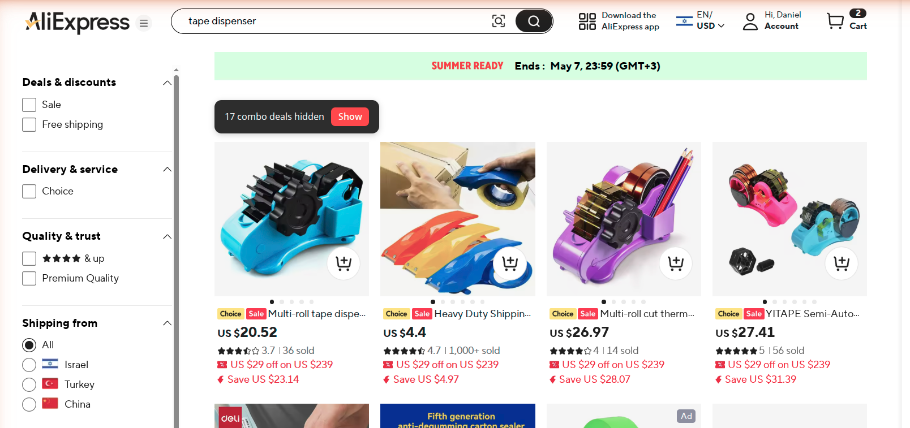
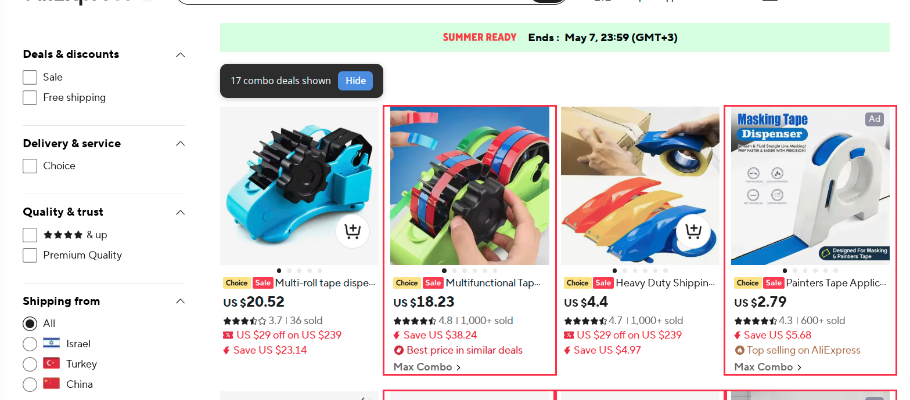
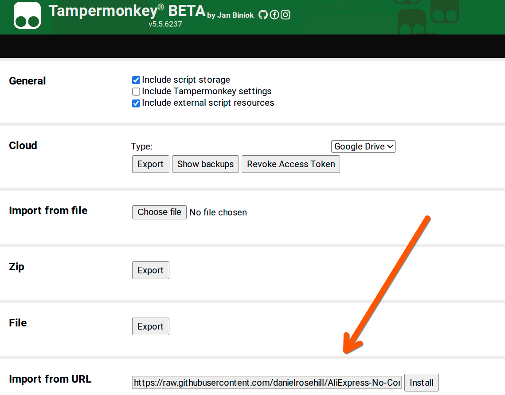
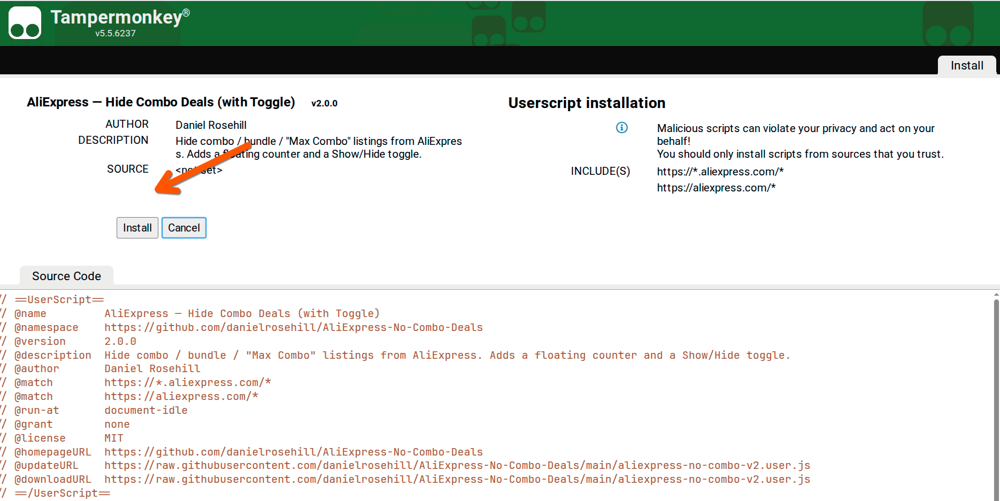
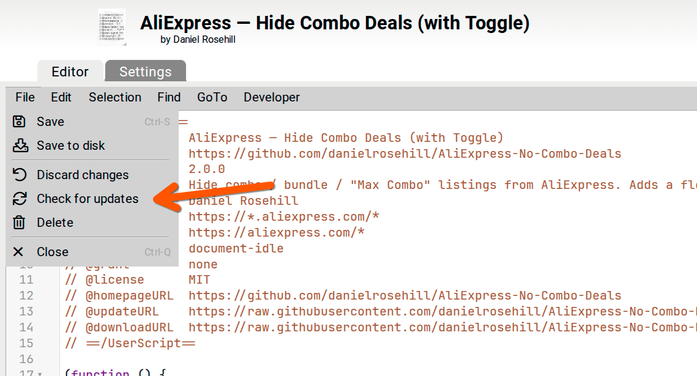

# AliExpress — Hide Combo Deals

A small userscript that hides combo / bundle / "Max Combo" listings from
AliExpress search and category pages, so the grid only shows single-item
listings.

## Screenshots

**v2 — combo deals hidden** (default), with an inline counter and
**Show** toggle above the grid:



**v2 — combo deals shown** after clicking *Show* (combo cards are the
ones that were previously hidden — outlined here just to show what was
removed):



## Why

**Purpose: exclude AliExpress search results for items that are only
available via combo deals** — i.e. listings where the headline price is
conditional on buying a multi-item bundle ("Max Combo", "Combo deal",
"Bundle deal", etc.) rather than reflecting the price of a single unit.

These cards pollute search results because:

- The displayed price is the bundle price, not the single-unit price, so
  they break price-sorting and price-comparison.
- The actual single-unit price (if available at all) is usually higher
  than competing single-item listings.
- They're often pushed to the top of the grid by AliExpress's promo
  ranking, displacing genuine single-item options.

This script strips them out so the grid only shows listings you can
actually buy as a single item at the price shown.

## What it hides

Cards whose visible text contains any of:

- `Max Combo`
- `Combo deal`
- `Bundle deal`
- `Buy more save more`
- `More to love`

Matching is case-insensitive and tolerant of non-breaking spaces. Edit
`COMBO_MARKERS` in the script to add/remove phrases.

## Install

You need a userscript manager browser extension. Pick one:

| Browser | Recommended | Notes |
|---|---|---|
| Chrome / Edge / Brave / Opera | **Tampermonkey** | The default. Most actively maintained, supports auto-update. |
| Firefox | **Violentmonkey** (or Tampermonkey) | Both work; Violentmonkey is fully open source. |
| Safari | **Userscripts** (by Justin Wasack) | Free, App Store. |
| Greasemonkey (Firefox) | works but legacy | Tampermonkey/Violentmonkey are the modern choice. |

**Recommendation: Tampermonkey** — broadest compatibility, supports the
`@updateURL` / `@downloadURL` directives in this script so you'll get
updates automatically when this repo changes.

### One-click install

Two versions are published — pick one (or install both, they have
distinct names so they won't collide).

**v2 (recommended)** — adds a counter and Show/Hide toggle:

```
https://raw.githubusercontent.com/danielrosehill/AliExpress-No-Combo-Deals/main/aliexpress-no-combo-v2.user.js
```

**v1** — silent, hide-only, minimal:

```
https://raw.githubusercontent.com/danielrosehill/AliExpress-No-Combo-Deals/main/aliexpress-no-combo.user.js
```

### Step-by-step (Tampermonkey)

1. Open the Tampermonkey **Dashboard** → **Utilities** tab.
2. Paste the v2 URL above into the **Import from URL** field and click
   **Install**.

   

3. The script preview screen appears — click **Install**.

   

4. Reload any open AliExpress tab. You should see the dark
   `"X combo deals hidden [Show]"` badge above the search grid.

Tampermonkey/Violentmonkey will also intercept the `.user.js` URL if you
just click it directly in a browser — same install screen, one fewer
step.

### Manual install

1. Open the userscript manager dashboard.
2. Create a new script.
3. Paste the contents of [`aliexpress-no-combo.user.js`](./aliexpress-no-combo.user.js).
4. Save.
5. Reload any open AliExpress tabs.

### Pulling updates

The script declares `@updateURL`, so Tampermonkey will pull new
versions automatically (default: once a day). To force-check now:

1. Open the Tampermonkey **Dashboard** and click the script name to
   open it.
2. **File → Check for updates**.



If a newer `@version` is on `main`, Tampermonkey will fetch it and
prompt you to confirm the update.

## Verify it's working

Open an AliExpress search page (e.g. `aliexpress.com/w/wholesale-tape-dispenser.html`)
and open the browser console. You should see lines like:

```
[no-combo] hid 8 combo card(s) — total 8
```

To see what it hides instead of removing them, change `MODE` from
`'hide'` to `'mark'` at the top of the script — combo cards will be
outlined in red rather than removed.

## How it works

- Anchors on `.search-card-item` (the stable, non-hashed class on each
  product card) and `.search-item-card-wrapper-gallery` (the grid cell).
- Avoids matching on AliExpress's hashed/obfuscated CSS classes
  (`lw_*`, `hm_*`, etc.) which rotate between builds.
- Uses a `MutationObserver` to catch infinite-scroll and SPA re-renders.

## Licence

MIT
